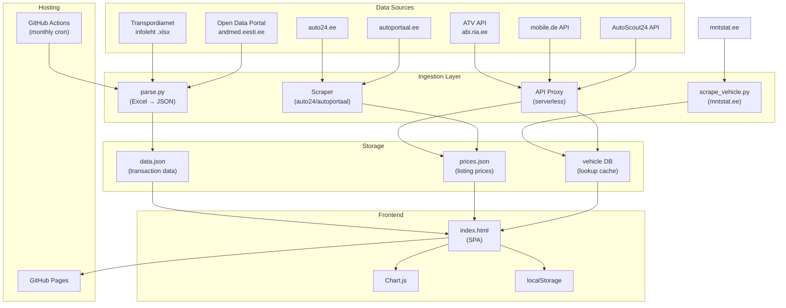
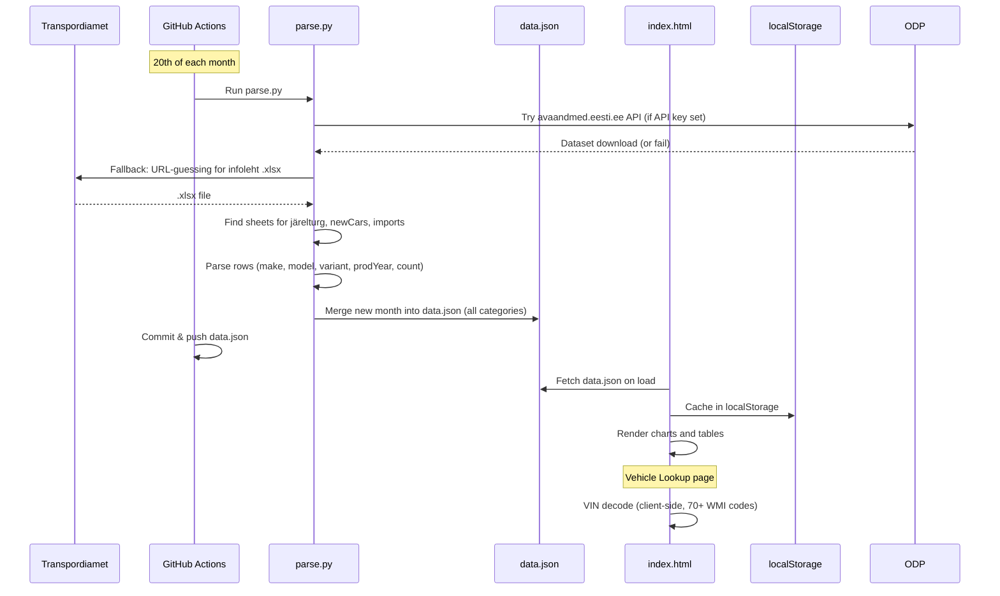

# Architecture

> System components, data flow, technology decisions, and integration design.

**Last updated:** 2026-03-26

---

## 1. System Overview



---

## 2. Current Architecture (v1)

The current system is deliberately simple: a static site with a Python data pipeline.

### Components

| Component | Technology | Purpose |
|-----------|-----------|---------|
| **Frontend** | `index.html` (~2100 lines, inline CSS + JS) | Single-page dashboard with 4 views (Overview, Comparison, Sync, Vehicle Lookup) |
| **Charts** | Chart.js 4.4.1 (CDN) | Line, donut, bar, and stacked bar charts |
| **Excel parsing** | SheetJS 0.18.5 (CDN) | Client-side .xlsx parsing for manual uploads |
| **Data pipeline** | `parse.py` (Python 3, openpyxl) | Server-side Excel parsing for 3 categories, outputs data.json. Tries avaandmed.eesti.ee API first, falls back to URL-guessing |
| **Vehicle scraper** | `scrape_vehicle.py` (Python 3) | Server-side mntstat.ee scraper for vehicle lookup by reg number or filters |
| **VIN decode** | Client-side JS in `index.html` | Decodes make + model year from VIN using 70+ WMI codes |
| **Storage** | `data.json` (committed to repo) | 26 months × 2 categories (järelturg + newCars) transaction data |
| **Client storage** | localStorage (`jarelturDB_v3`) | Cached data for offline use |
| **CI/CD** | GitHub Actions | Monthly cron on 20th runs parse.py and commits data.json |
| **Hosting** | GitHub Pages | Static file serving |

### Data Flow (current)



### parse.py Details

- **API-first fetching:** `try_opendata_api()` searches avaandmed.eesti.ee for infoleht dataset using `OPENDATA_API_KEY` env var. Falls back to URL-guessing if API unavailable.
- **URL generation:** `candidate_urls()` builds candidate download URLs using multiple naming patterns (`INFOLEHT-MMYYYY.xlsx`, `_statistika_esmased_ja_uued`, URL-encoded variants, etc.)
- **Multi-category parsing:** `find_sheet_by_category(wb, category)` searches sheets using `SHEET_KEYWORDS` dict for járelturg, newCars, and imports keywords
- **Column detection:** Identifies make (mark/märk), model (mudel), production year (aasta), and count (arv/kokku/hulk) columns
- **Model splitting:** `split_model_variant()` splits "GOLF GTI" into model="GOLF", variant="GTI". Special handling for multi-word models like Tesla "MODEL 3", "MODEL S", "MODEL X", "MODEL Y"
- **Deduplication:** Merges new month data with existing data.json, replacing if month already exists
- **Format migration:** `load_data()` auto-migrates old `{months:[]}` format to new `{jarelturg:[], newCars:[], imports:[]}` schema

### scrape_vehicle.py Details

- **Registration lookup:** `search_by_reg(reg)` queries `mntstat.ee/search.php?reg_nr=XXX`
- **Filtered search:** `search_by_filters(make, model, year_from, year_to)` uses `make[]`, `model[]`, `from`, `to` params
- **HTML parsing:** Extracts `<td>` cells from `searchResult` table, groups by 13 columns (Staatus, Kokku, Mark, Mudel, Keretüüp, Aasta, Värv, Mootoritüüp, Käigukast, Kw, CC, Kg, Maakond)
- **CLI usage:** `python scrape_vehicle.py 100BMW --json`
- **Note:** Server-side only (CORS prevents client-side use). Reg tab UI is ready but pending live data access.

### VIN Decode (client-side)

- `WMI_MAP`: 70+ World Manufacturer Identifier codes covering top 20+ Estonian-market makes
- `YEAR_CODES`: Model year decode from VIN position 10
- `decodeVIN(vin)` validates (17 chars, no I/O/Q) and returns `{isValid, vin, wmi, vds, make, modelYear, yearCode, plant, serial}`

---

## 3. Planned Architecture (v2+)

### Expanded Ingestion

Each data source gets its own ingestion script:

| Script | Source | Output | Schedule |
|--------|--------|--------|----------|
| `parse.py` | Transpordiamet .xlsx + avaandmed.eesti.ee API | data.json (transactions, 3 categories) | Monthly (20th) |
| `scrape_vehicle.py` | mntstat.ee | Vehicle specs (stdout/JSON) | On-demand |
| `fetch_mobile.py` | mobile.de API | prices.json | Weekly |
| `fetch_autoscout.py` | AutoScout24 API | prices.json | Weekly |
| `scrape_auto24.py` | auto24.ee | prices.json | Weekly |
| `fetch_vehicle.py` | ATV API | vehicle cache | On-demand |

### API Proxy Layer

Client-side JavaScript cannot call external APIs directly due to CORS. Options:

1. **Cloudflare Workers** (recommended) — Free tier, edge-deployed, handles auth secrets
2. **Vercel Edge Functions** — Alternative serverless option
3. **Server-side only** — All API calls happen in GitHub Actions; results committed as JSON

Decision: Start with option 3 (server-side pipeline via GitHub Actions) to keep architecture simple. Move to option 1 when real-time vehicle lookup is needed (Phase 2).

### Storage Evolution

| Stage | Storage | When | Trigger |
|-------|---------|------|---------|
| Current | `data.json` (~1MB) | Now | Works fine for transaction data |
| Next | Multiple JSON files (data.json + prices.json) | Phase 3 | Pricing data from multiple sources |
| Future | SQLite or cloud DB (Supabase/PlanetScale) | Phase 3-4 | When JSON files exceed ~10MB or query complexity grows |

---

## 4. API Integration Design

### Transpordiamet ATV (abi.ria.ee/teabevarav/)
- **Auth:** Credential-based (organization API key)
- **Data:** Vehicle registry, VIN lookup, registration number lookup
- **Integration:** Server-side Python script → cached JSON responses
- **Rate limits:** Unknown, need to confirm with Transpordiamet
- **Action needed:** Contact Transpordiamet for API credentials

### Estonian Open Data Portal (avaandmed.eesti.ee)
- **Auth:** API key (free registration at avaandmed.eesti.ee), set via `OPENDATA_API_KEY` env var
- **Docs:** avaandmed.eesti.ee/api/v1/
- **Data:** Infoleht datasets, vehicle registration statistics
- **Integration:** Built into `parse.py` via `try_opendata_api()` — API-first with URL-guessing fallback
- **Status:** DONE — integrated in Phase 2
- **Rate limits:** Reasonable public API limits

### mntstat.ee
- **Auth:** None (public web)
- **Data:** 829K+ registered vehicles in Estonia with specs
- **Endpoints:** `search.php?reg_nr=XXX` (reg lookup), `search.php?make[]=BMW&from=2020&to=2025` (filtered), `data.php` POST (model dropdown)
- **Integration:** `scrape_vehicle.py` — server-side HTML scraping
- **Status:** DONE — integrated in Phase 2

### mobile.de
- **Auth:** HTTP Basic (username/password)
- **Docs:** services.mobile.de/docs/search-api.html
- **Data:** Vehicle listings with prices, search/filter
- **Integration:** Python script → prices.json
- **Rate limits:** Per-account, need to confirm
- **Action needed:** Request API account from mobile.de

### AutoScout24
- **Auth:** OAuth
- **Docs:** listing-creation.api.autoscout24.com/docs
- **Data:** Vehicle listings, make/model reference data, pricing
- **Integration:** Python script → prices.json
- **Third-party option:** Carapis (docs.carapis.com) provides parsed data with code examples

### auto24.ee
- **Auth:** No public API
- **Options:** Web scraping (Playwright/Puppeteer) or direct partnership
- **Data:** Estonian vehicle listings with prices
- **Legal consideration:** Scraping may violate ToS — explore partnership first

### autoportaal.ee
- **Auth:** No public API
- **Options:** Same as auto24.ee
- **Data:** Estonian vehicle listings and prices

---

## 5. Frontend Architecture

### Current Structure (single-file SPA)

```
index.html (~2100 lines)
├── <style>       CSS (design tokens, layout, components, combobox, vehicle lookup)
├── <body>        HTML (sidebar with categories + views, topbar, 4 page containers)
└── <script>      JavaScript
    ├── State     (db object with 3 categories, activeCategory, localStorage persistence)
    ├── Categories(switchCategory(), activeMonths(), CATEGORY_LABELS, CATEGORY_DESC)
    ├── Router    (showPage(), nav button handlers, pageTitlesForCategory())
    ├── Parsers   (parseFile(), extractJarelturg(), detectMonthYear())
    ├── Combobox  (createCombobox() factory — reusable searchable dropdown)
    ├── Render    (renderOverview(), renderComparisonPage(), renderComparison())
    ├── Vehicle   (decodeVIN(), showVehicleInfo(), showVehicleMarketData())
    ├── Charts    (Chart.js instances, chartOpts(), destroyChart(), stacked bar for koguTurg)
    ├── Sync      (triggerAutoFetch(), handleFiles())
    └── Utils     (colorFor(), log(), setProgress())
```

### Evolution Path

1. **Phase 0-2 (DONE):** Single `index.html` with 4 views, category navigation, vehicle lookup. Currently ~2100 lines.
2. **Phase 3:** If file exceeds ~3000 lines, split into `styles.css`, `app.js`, and `index.html`.
3. **Phase 4-5:** Evaluate component framework (Svelte or Preact) if UI complexity warrants it. Decision gate: if more than 5 distinct interactive views are needed.

---

## 6. Architecture Decision Records

### ADR-001: Vanilla JS over framework
**Decision:** No framework. Single index.html with inline CSS and JS.
**Rationale:** Zero build step, instant deployment to GitHub Pages, no node_modules, easy to understand for any developer. The current feature set (3 pages, ~10 charts) doesn't justify framework overhead.
**Revisit when:** More than 5 interactive views, or significant state management complexity.

### ADR-002: data.json over database
**Decision:** Store all data as a JSON file committed to the repository.
**Rationale:** GitHub Pages is static-only. JSON file is versioned in git, accessible via fetch(), and works offline via localStorage. Current data size (~1MB for 26 months) is well within limits.
**Revisit when:** Total data files exceed 10MB, or real-time queries are needed.

### ADR-003: Server-side pipeline over client-side parsing
**Decision:** Use parse.py (server-side) as primary data ingestion, keep SheetJS for manual uploads.
**Rationale:** Server-side parsing is more reliable, handles .xls format via xlrd, and allows automated monthly updates via GitHub Actions.
**Revisit when:** Never — this is the right long-term pattern.

### ADR-004: When to introduce a backend
**Decision:** Defer until Phase 3 (pricing intelligence).
**Rationale:** Phase 2 vehicle lookup is handled via client-side VIN decode and server-side mntstat.ee scraper (CLI tool). Real-time API calls for pricing data in Phase 3 will need a server or serverless proxy.
**Target:** Cloudflare Workers for lightweight API proxy.
**Updated:** Phase 2 completed without needing a backend — mntstat.ee scraper runs server-side only, reg tab UI is ready but pending live data integration.

### ADR-005: API-first data fetching with fallback
**Decision:** parse.py tries avaandmed.eesti.ee Open Data API first, falls back to URL-guessing for Transpordiamet files.
**Rationale:** API is more reliable and forward-looking than URL-guessing (which depends on undocumented naming conventions). Fallback ensures continuity if API is down or API key not configured.
**Date:** 2026-03-25
