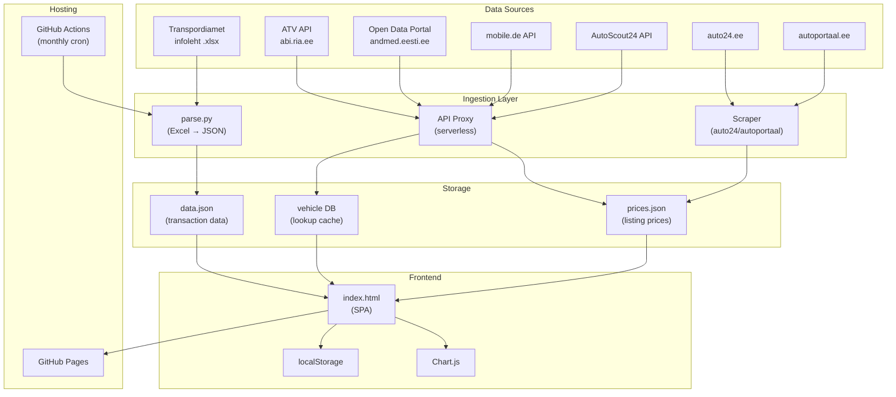
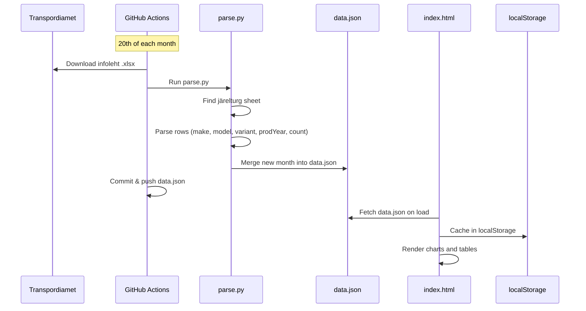

# Architecture

> System components, data flow, technology decisions, and integration design.

**Last updated:** 2026-03-24

---

## 1. System Overview



---

## 2. Current Architecture (v1)

The current system is deliberately simple: a static site with a Python data pipeline.

### Components

| Component | Technology | Purpose |
|-----------|-----------|---------|
| **Frontend** | `index.html` (1590 lines, inline CSS + JS) | Single-page dashboard with 3 views |
| **Charts** | Chart.js 4.4.1 (CDN) | Line, donut, and bar charts |
| **Excel parsing** | SheetJS 0.18.5 (CDN) | Client-side .xlsx parsing for manual uploads |
| **Data pipeline** | `parse.py` (Python 3, openpyxl) | Server-side Excel parsing, outputs data.json |
| **Storage** | `data.json` (committed to repo) | 26 months of järelturg transaction data |
| **Client storage** | localStorage (`jarelturDB_v3`) | Cached data for offline use |
| **CI/CD** | GitHub Actions | Monthly cron on 20th runs parse.py and commits data.json |
| **Hosting** | GitHub Pages | Static file serving |

### Data Flow (current)



### parse.py Details

- **URL generation:** Builds candidate download URLs for Transpordiamet infoleht files using multiple naming patterns (`INFOLEHT-MMYYYY.xlsx`, `INFOLEHT-MM-YYYY.xlsx`, etc.)
- **Sheet detection:** `find_jarelturg_sheet()` searches for sheets containing keywords: järelturg, jarelturg, omaniku, owner, used, kasutatud
- **Column detection:** Identifies make (mark/märk), model (mudel), production year (aasta), and count (arv/kokku/hulk) columns
- **Model splitting:** `split_model_variant()` splits "GOLF GTI" into model="GOLF", variant="GTI". Special handling for multi-word models like Tesla "MODEL 3", "MODEL S", "MODEL X", "MODEL Y"
- **Deduplication:** Merges new month data with existing data.json, replacing if month already exists

---

## 3. Planned Architecture (v2+)

### Expanded Ingestion

Each data source gets its own ingestion script:

| Script | Source | Output | Schedule |
|--------|--------|--------|----------|
| `parse.py` | Transpordiamet .xlsx | data.json (transactions) | Monthly (20th) |
| `fetch_odp.py` | andmed.eesti.ee API | data.json (registry data) | Monthly |
| `fetch_mobile.py` | mobile.de API | prices.json | Weekly |
| `fetch_autoscout.py` | AutoScout24 API | prices.json | Weekly |
| `scrape_auto24.py` | auto24.ee | prices.json | Weekly |
| `fetch_vehicle.py` | ATV API | vehicle cache | On-demand |

### API Proxy Layer

Client-side JavaScript cannot call external APIs directly due to CORS. Options:

1. **Cloudflare Workers** (recommended) — Free tier, edge-deployed, handles auth secrets
2. **Vercel Edge Functions** — Alternative serverless option
3. **Server-side only** — All API calls happen in GitHub Actions; results committed as JSON

Decision: Start with option 3 (server-side pipeline via GitHub Actions) to keep architecture simple. Move to option 1 when real-time vehicle lookup is needed (Phase 2).

### Storage Evolution

| Stage | Storage | When | Trigger |
|-------|---------|------|---------|
| Current | `data.json` (~1MB) | Now | Works fine for transaction data |
| Next | Multiple JSON files (data.json + prices.json) | Phase 3 | Pricing data from multiple sources |
| Future | SQLite or cloud DB (Supabase/PlanetScale) | Phase 3-4 | When JSON files exceed ~10MB or query complexity grows |

---

## 4. API Integration Design

### Transpordiamet ATV (abi.ria.ee/teabevarav/)
- **Auth:** Credential-based (organization API key)
- **Data:** Vehicle registry, VIN lookup, registration number lookup
- **Integration:** Server-side Python script → cached JSON responses
- **Rate limits:** Unknown, need to confirm with Transpordiamet
- **Action needed:** Contact Transpordiamet for API credentials

### Estonian Open Data Portal (andmed.eesti.ee)
- **Auth:** None (public)
- **Docs:** andmed.eesti.ee/api/dataset-docs/
- **Data:** Vehicle registration statistics, transport data
- **Integration:** Python script in GitHub Actions, outputs to data.json
- **Rate limits:** Reasonable public API limits

### mobile.de
- **Auth:** HTTP Basic (username/password)
- **Docs:** services.mobile.de/docs/search-api.html
- **Data:** Vehicle listings with prices, search/filter
- **Integration:** Python script → prices.json
- **Rate limits:** Per-account, need to confirm
- **Action needed:** Request API account from mobile.de

### AutoScout24
- **Auth:** OAuth
- **Docs:** listing-creation.api.autoscout24.com/docs
- **Data:** Vehicle listings, make/model reference data, pricing
- **Integration:** Python script → prices.json
- **Third-party option:** Carapis (docs.carapis.com) provides parsed data with code examples

### auto24.ee
- **Auth:** No public API
- **Options:** Web scraping (Playwright/Puppeteer) or direct partnership
- **Data:** Estonian vehicle listings with prices
- **Legal consideration:** Scraping may violate ToS — explore partnership first

### autoportaal.ee
- **Auth:** No public API
- **Options:** Same as auto24.ee
- **Data:** Estonian vehicle listings and prices

---

## 5. Frontend Architecture

### Current Structure (single-file SPA)

```
index.html
├── <style>       CSS (design tokens, layout, components)
├── <body>        HTML (sidebar, topbar, 3 page containers)
└── <script>      JavaScript
    ├── State     (db object, localStorage persistence)
    ├── Router    (showPage(), nav button handlers)
    ├── Parsers   (parseFile(), extractJarelturg(), detectMonthYear())
    ├── Render    (renderOverview(), renderComparisonPage(), renderComparison())
    ├── Charts    (Chart.js instances, chartOpts(), destroyChart())
    ├── Sync      (triggerAutoFetch(), handleFiles())
    └── Utils     (colorFor(), log(), setProgress())
```

### Evolution Path

1. **Phase 1-2:** Stay with single `index.html`. Add new page sections for market categories and vehicle lookup.
2. **Phase 3:** If file exceeds ~3000 lines, split into `styles.css`, `app.js`, and `index.html`.
3. **Phase 4-5:** Evaluate component framework (Svelte or Preact) if UI complexity warrants it. Decision gate: if more than 5 distinct interactive views are needed.

---

## 6. Architecture Decision Records

### ADR-001: Vanilla JS over framework
**Decision:** No framework. Single index.html with inline CSS and JS.
**Rationale:** Zero build step, instant deployment to GitHub Pages, no node_modules, easy to understand for any developer. The current feature set (3 pages, ~10 charts) doesn't justify framework overhead.
**Revisit when:** More than 5 interactive views, or significant state management complexity.

### ADR-002: data.json over database
**Decision:** Store all data as a JSON file committed to the repository.
**Rationale:** GitHub Pages is static-only. JSON file is versioned in git, accessible via fetch(), and works offline via localStorage. Current data size (~1MB for 26 months) is well within limits.
**Revisit when:** Total data files exceed 10MB, or real-time queries are needed.

### ADR-003: Server-side pipeline over client-side parsing
**Decision:** Use parse.py (server-side) as primary data ingestion, keep SheetJS for manual uploads.
**Rationale:** Server-side parsing is more reliable, handles .xls format via xlrd, and allows automated monthly updates via GitHub Actions.
**Revisit when:** Never — this is the right long-term pattern.

### ADR-004: When to introduce a backend
**Decision:** Defer until Phase 2 (vehicle lookup).
**Rationale:** Transaction data and pricing data can be pre-computed and served as static JSON. Vehicle lookup requires real-time API calls which need a server or serverless proxy.
**Target:** Cloudflare Workers for lightweight API proxy.
